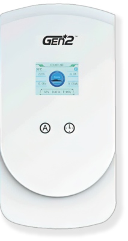
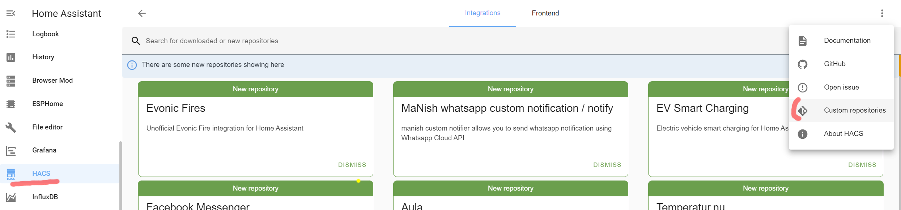
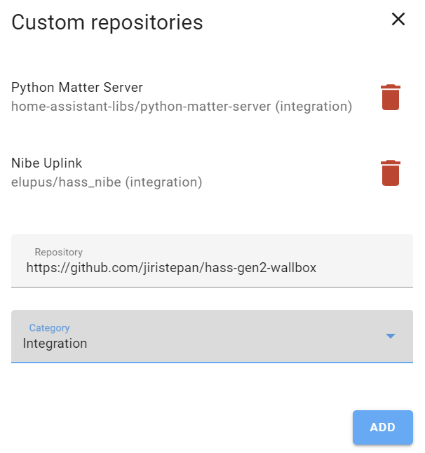
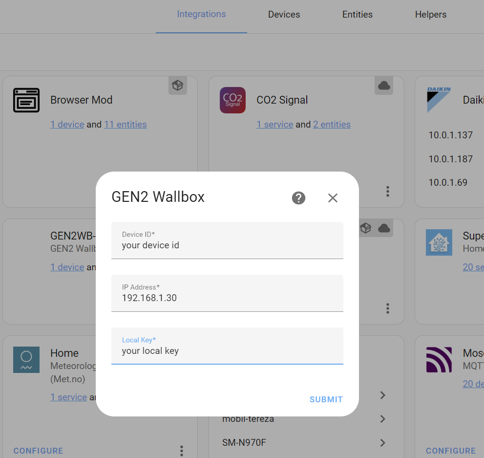
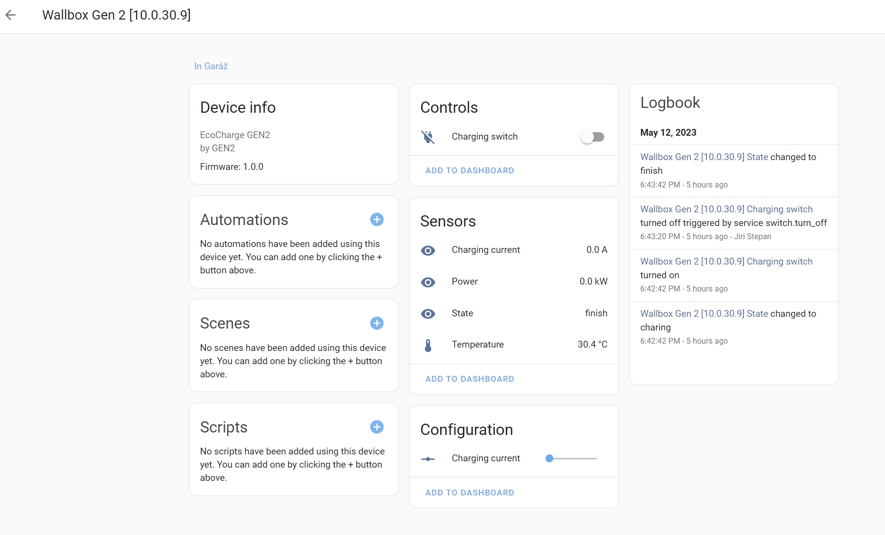

# GEN2 Wallbox for Home Assistant

This is an integration for the GEN2 EcoCharge wallbox installed by MalinaGroup mainly in CZ/SK or DE. This one:

This wallbox is a rebranded Tuya and can be controlled using the tinytuy library (https://github.com/jasonacox/tinytuya) via a local network.  

## Installation via HACS - recommended
The preferred option is HACS (Home Assistant Community Store).

1. Install HACS on your Home Assistant (https://hacs.xyz/docs/setup/download/).

2. **Add this store**. 
 3. Go to HACS -> Integration. 
 
 Add this repository URL as "Integration".
 

3. Search for the GEN2 Wallbox integration and download it.
4. Restart the Home Assistant application

## Manual installation
Copy the contents of `custom_components/gen2_wallbox` to your home assistant `config/custom_integrations` and restart HA. 

## Configuration
First, connect the wallbox to the Tuya SmartHome app and set up the wifi network for the wallbox. 

Then you need to prepare three information for successful configuration:
- the local IP address of the wallbox
- Device ID
- local device key

For this part, you need to use the tuya iot platform. Please watch this great video:

https://www.youtube.com/watch?v=Q1ZShFJDvE0

Then you simply add the new **GEN2 Wallbox** integration in *Settings > Devices & Services "*.

That's it. You will see the new device and six new entities.

The integration has:
- **4 sensors**:
    - Device temperature [C]
    - device status (connected, charging, done)
    - device output current in [A]
    - device output power [kW] - this value is very special. I think the device is reporting the wrong value.

- **1 confing number**: maximum charging current from 8 to 16 A
- **1 switch** that starts/stops the charging process. It takes approximately 5-10 s to start. So be patient before the integration responds.

